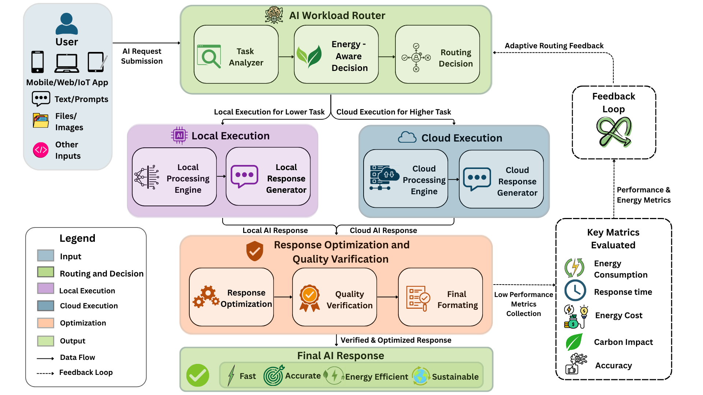

# GreenMind

**Adaptive, energy-aware AI workload routing.**

GreenMind decides, per request, whether a prompt should run on a lightweight local model or a larger cloud model — based on how demanding the specific prompt actually is and how much capability the device making the request actually has right now. The goal is to stop sending trivial prompts to the cloud and stop asking underpowered devices to run models they can't realistically handle.

## System architecture



A request enters through the frontend, gets analyzed and scored by the AI Workload Router, is executed by either the local or cloud path, and the result is returned to the user. The diagram also shows the full intended design, including an adaptive feedback loop and a metrics dashboard — see [Implementation status](#implementation-status) below for what's built today versus planned.

## Implementation status

| Component | Status | Notes |
|---|---|---|
| Request submission (web frontend) | ✅ Implemented | React + Vite chat UI |
| Task Analyzer | ✅ Implemented | `PromptAnalyzer` — regex-based action/domain/reasoning scoring |
| Device profiling | ✅ Implemented | `DeviceProfiler` — real CPU/RAM/GPU/battery telemetry + live benchmark |
| Routing decision | ✅ Implemented | `WorkloadRouter` — compares device score, prompt score, RAM, and battery |
| Local execution | ✅ Implemented | `local_engine` — runs the prompt on Ollama, on-device |
| Cloud execution | ✅ Implemented | `cloud_engine` — runs the prompt on Gemini 2.5 Flash |
| Adaptive routing feedback loop | 🔲 Planned | Router does not yet learn from past decision outcomes |
| Response optimization & quality verification | 🔲 Planned | Responses are currently returned as-is from whichever model ran |
| Key metrics dashboard (energy / cost / carbon / accuracy) | 🔲 Partial | `energy_decision.py` computes estimated energy and carbon figures but is not yet wired into the live `/process` pipeline or surfaced in the UI |

## Tech stack

- **Backend:** Python, FastAPI
- **Frontend:** React, Vite, Tailwind CSS
- **Local inference:** Ollama (model chosen dynamically per tier — see below)
- **Cloud inference:** Google Gemini 2.5 Flash, via the `google-genai` SDK
- **Device profiling:** psutil (hardware telemetry), NumPy (compute micro-benchmark)

## Which models are actually used

Local execution doesn't call one fixed model — it picks from a tier based on what the prompt needs and what's installed:

| Tier | Example Ollama models |
|---|---|
| Standard Local LLM (7B–8B) | `llama3.1:8b`, `mistral:7b`, `qwen2.5:7b` |
| Compact SLM (1.5B–3.8B) | `llama3.2:3b`, `phi3.5`, `qwen2.5:1.5b` |
| Micro SLM | `qwen2.5:0.5b`, `smollm2` |

Cloud execution always targets `gemini-2.5-flash`.

## Project structure

```
GreenMind/
├── backend/
│   ├── device_profiler/     # hardware detection + S_avail scoring
│   ├── workload_router/     # PromptAnalyzer + WorkloadRouter + S_req scoring
│   ├── schemas/             # request/response models
│   ├── main.py              # FastAPI entrypoint (/process)
│   └── requirements.txt
├── local_engine/            # Ollama client, model registry, executor
├── cloud_engine/            # Gemini client, executor
├── frontend/
│   └── src/
│       ├── pages/Chat.jsx
│       └── components/      # PromptAnalysisCard, DeviceProfileCard,
│                             # RoutingDecisionCard, ExecutionCard, ...
├── database/
├── monitoring/
├── optimizer/
├── router/
└── training/
```

## How a request works, end to end

1. The frontend sends `{ "prompt": "..." }` to the backend's `/process` endpoint.
2. The backend independently profiles the device (CPU, RAM, GPU, battery, and a live compute benchmark) and analyzes the prompt (detected action, domain, reasoning depth, token count).
3. `WorkloadRouter` compares the device's available score against the prompt's required score, checks RAM headroom, checks a hard tier-compatibility rule, and checks battery level — then decides local or cloud.
4. Whichever engine won actually executes the prompt: `local_engine` calls a real Ollama model running on the machine; `cloud_engine` calls the real Gemini API.
5. The real generated text, token counts, and timing are returned alongside the full analysis, and rendered as separate cards in the chat UI.

## Getting started

### Prerequisites

- Python 3.10+
- Node.js and npm
- [Ollama](https://ollama.com) installed and running locally
- A free Gemini API key from [aistudio.google.com/apikey](https://aistudio.google.com/apikey)

### Backend setup

```bash
cd backend
pip install -r requirements.txt
```

Create a `.env` file at the project root (next to `backend/`, `local_engine/`, and `cloud_engine/`):

```
GEMINI_API_KEY=your_key_here
```

Pull at least one local model:

```bash
ollama pull qwen2.5:0.5b
```

Run the backend:

```bash
uvicorn main:app --reload
```

### Frontend setup

```bash
cd frontend
npm install
npm run dev
```

## API

### `POST /process`

Request:

```json
{ "prompt": "Write a short thank you note." }
```

Response (abridged):

```json
{
  "greenmind_status": "Workload analysis completed",
  "execution": {
    "engine_used": "local",
    "success": true,
    "model_used": "qwen2.5:0.5b",
    "response_text": "...",
    "prompt_tokens": 36,
    "completion_tokens": 130,
    "total_duration_s": 7.89
  },
  "prompt_analysis": {
    "task_category": "Writing Task",
    "target_model_tier": "Micro SLM",
    "required_score": 10.6
  },
  "device_profile": {
    "available_score": 29.8,
    "supported_tier": "Tier 1: Micro SLM Capable"
  },
  "routing_decision": {
    "decision": "It can be executed locally",
    "can_execute_locally": true,
    "reasons": [
      "Score Headroom: Device S_avail (29.8) meets required S_req (10.6).",
      "Memory Headroom: Available RAM (3.9 GB) satisfies model requirement (1.5 GB)."
    ]
  }
}
```

## Known limitations

- **RAM check is capacity-based, not availability-based.** `WorkloadRouter` estimates usable RAM as `total_gb × 0.5`, a fixed number that ignores how much memory is actually free at request time.
- **Prompt length barely affects the routing score.** The token-count component of `S_required` is capped at 5 points out of 100 — a prompt ten times longer only gains a few extra points, so very long prompts can still route to the smallest local tier.
- **Gemini's internal "thinking" tokens aren't separately accounted for.** They draw from the same output budget as the visible answer and carry a real energy/latency cost that isn't reflected in `completion_tokens` alone.

## Roadmap

- Adaptive routing feedback loop that learns from past routing outcomes
- Automated response quality verification before returning results
- Live energy / cost / carbon dashboard, built on the existing `energy_decision.py` logic
